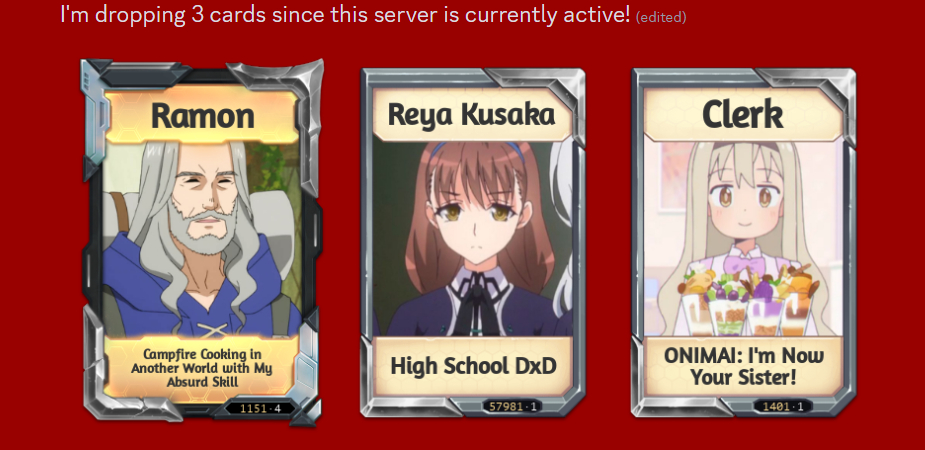

# Karuta Helper - Chrome Extension for Karuta Discord Bot

## Features
- marks wishlists, server drops and your own drops
- stops chat from scrolling during server/ your drop
- (buggy) displays text for high wishlist cards (currently 500x 300+ wl cards found in [wishlist.txt](https://github.com/Lexer727/karuta-helper/blob/master/assets/wishlist.txt))
- (buggy) displays text for single, low and high print

## Installation
To install the extension clone the repository.  

After that you have to:
- Access Chrome Extension Settings through the three vertical dots in the top-right corener -> "Settings" -> "Extensions" or enter "chrome://extensions/" into your search bar
- Enable Developer Mode in the top-right corner
- Load the Unpacked Extension
- Open Discord in Chrome

## How it works  
The [content.js](https://github.com/Lexer727/karuta-helper/blob/master/js/content.js) script observes the chat DOM for added messages and checks if they are send from the Karuta Bot.  

For wishlist and print information the image of each drop gets processed with [Tesseract.js](https://github.com/naptha/tesseract.js) running localy in the browser. 

To add more Cards to the Wishlist dataset go to [assets/](https://github.com/Lexer727/karuta-helper/blob/master/assets) and either add them directly to [wldata.json](https://github.com/Lexer727/karuta-helper/blob/master/assets/wldata.json) 
or add them to the text file [wishlist.txt](https://github.com/Lexer727/karuta-helper/blob/master/assets/wishlist.txt) 
and use the python script [txtToJson.py](https://github.com/Lexer727/karuta-helper/blob/master/assets/txtToJson.py) to generate the json.

## Settings
You can change colors and other things at the beginning of [content.js](https://github.com/Lexer727/karuta-helper/blob/master/js/content.js).  

If you want to mark and stop the chat from scrolling during your own drops add your server nickname in the extension ui  

## Example Server Drop

## Example High Wishlist/ High Print Drop

## Problems
 - name and print recognition for wishlist/ print check not perfect (needs better image preprocessing/ custom training data)
 - sometimes messages dont get recognized as Karuta Bot message and dont get checked
 - scroll lock sometimes buggs out
